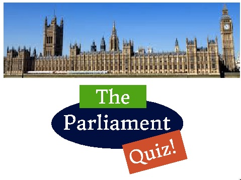

<iframe class="pull-right" width="560" height="315" src="//www.youtube.com/embed/RAMbIz3Y2JA?list=PL03FFE1F0B34AA057" frameborder="0" allowfullscreen></iframe>

##Welcome!

There's lots of fun things here about the United Kingdom Parliament. You will find lots of cool facts and figures, videos and information about what Parliament does. There is help, with a glossary explaining some of the weird words, and a quiz to test your knowledge. There is also a tool, where you can find out which MPs are most interested in kittens! (actually you can search any area of interest, we just care about kittens!).

##What does Parliament do?

Parliament is made up of the [House of Lords](lords.html) and the [House of Commons](commons.html). It is based at the Palace of Westminster in London.

<iframe class="pull-right" width="560" height="315" src="//www.youtube.com/embed/1KFGt9M-j28" frameborder="0" allowfullscreen></iframe>

Parliment makes laws:

Laws start of as Green papers, change to White papers, and, after discussion, from Bills to Laws.

##Take the Parliament Quiz!

